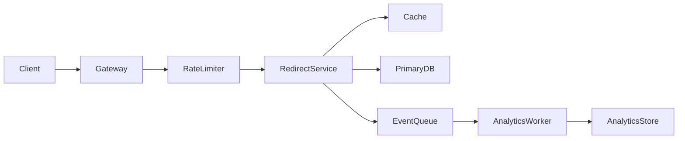

# Worked Interview Examples

Use these examples as teaching material before you generate a clean-room
practice target. Each lesson shows the pattern signal, dry run, implementation,
tests to add, and follow-ups.

## How To Study A Worked Example

1. Read the problem and constraints.
2. Predict the pattern before reading the code.
3. Trace the dry run by hand.
4. Rebuild the implementation in `practice/`.
5. Add one missing edge-case test.
6. Explain the production or follow-up version.

## Example 1: Two Sum

Level: beginner  
Pattern: hash map  
Target command:

```bash
bun run practice -- --problem twoSum
```

Problem: return indices of two numbers whose sum equals `target`.

Pattern signal:

- You need to find a prior value quickly.
- A nested loop would work but costs O(n^2).
- A map lets you ask: "Have I already seen `target - current`?"

Dry run:

```text
nums = [2, 7, 11, 15], target = 9
i=0 current=2 complement=7 map={}
store 2 -> 0
i=1 current=7 complement=2 map has 2 -> return [0, 1]
```

Implementation:

```ts
export function twoSum(
	nums: readonly number[],
	target: number,
): [number, number] | undefined {
	const seen = new Map<number, number>();

	for (let index = 0; index < nums.length; index++) {
		const current = nums[index]!;
		const complement = target - current;
		const complementIndex = seen.get(complement);

		if (complementIndex !== undefined) {
			return [complementIndex, index];
		}

		seen.set(current, index);
	}

	return undefined;
}
```

Complexity: O(n) time, O(n) auxiliary space.

Tests to add:

```ts
test("handles duplicate values", () => {
	expect(twoSum([3, 3], 6)).toEqual([0, 1]);
});

test("handles negative values", () => {
	expect(twoSum([-3, 4, 8, 11], 5)).toEqual([0, 2]);
});
```

Follow-ups:

- Return all pairs.
- Return values instead of indices.
- Solve when the input is sorted using two pointers and O(1) extra space.

## Example 2: Longest Substring Without Repeating Characters

Level: intermediate  
Pattern: sliding window  
Target command:

```bash
bun run practice -- --problem lengthOfLongestSubstring
```

Problem: find the longest substring with no repeated character.

Pattern signal:

- The answer is contiguous.
- The window becomes invalid when a duplicate enters.
- The left boundary only moves forward.

Invariant: the current window `[left, right]` contains no duplicate characters.

Dry run:

```text
s = "abba"
right=0 a -> window "a", best=1
right=1 b -> window "ab", best=2
right=2 b -> duplicate b, move left past previous b -> window "b"
right=3 a -> window "ba", best=2
```

Implementation:

```ts
export function lengthOfLongestSubstring(value: string): number {
	let left = 0;
	let best = 0;
	const lastSeen = new Map<string, number>();

	for (let right = 0; right < value.length; right++) {
		const char = value[right]!;
		const previous = lastSeen.get(char);

		if (previous !== undefined && previous >= left) {
			left = previous + 1;
		}

		lastSeen.set(char, right);
		best = Math.max(best, right - left + 1);
	}

	return best;
}
```

Complexity: O(n) time, O(min(n, alphabet)) space.

Tests to add:

```ts
test("handles repeated characters after the left boundary", () => {
	expect(lengthOfLongestSubstring("abba")).toBe(2);
});

test("handles empty input", () => {
	expect(lengthOfLongestSubstring("")).toBe(0);
});
```

Follow-ups:

- Return the substring itself.
- Handle Unicode grapheme clusters instead of UTF-16 code units.
- Explain why the algorithm is linear even though `left` moves inside the loop.

## Example 3: Koko Eating Bananas

Level: advanced  
Pattern: binary search on answer  
Target command:

```bash
bun run practice -- --problem kokoEatingBananas
```

Problem: find the minimum integer eating speed so all piles are finished within
`hours`.

Pattern signal:

- You are searching for a minimum feasible value.
- If speed `k` works, every speed greater than `k` also works.
- Feasibility is monotonic.

Invariant: the answer is always inside `[left, right]`.

Implementation:

```ts
export function kokoEatingBananas(
	piles: readonly number[],
	hours: number,
): number {
	let left = 1;
	let right = Math.max(...piles);

	const canFinish = (speed: number): boolean => {
		let usedHours = 0;

		for (const pile of piles) {
			usedHours += Math.ceil(pile / speed);
			if (usedHours > hours) return false;
		}

		return true;
	};

	while (left < right) {
		const mid = left + Math.floor((right - left) / 2);

		if (canFinish(mid)) {
			right = mid;
		} else {
			left = mid + 1;
		}
	}

	return left;
}
```

Complexity: O(n log m), where `m` is the largest pile. Space is O(1).

Tests to add:

```ts
test("finds the smallest feasible speed", () => {
	expect(kokoEatingBananas([3, 6, 7, 11], 8)).toBe(4);
});

test("handles one pile", () => {
	expect(kokoEatingBananas([30], 5)).toBe(6);
});
```

Follow-ups:

- What if `hours < piles.length`?
- What if pile sizes exceed safe integer range?
- What other problems use the same "minimum feasible answer" template?

## Example 4: Coin Change

Level: advanced  
Pattern: dynamic programming  
Target command:

```bash
bun run practice -- --problem coinChange
```

Problem: return the fewest coins needed to make `amount`, or `-1` if impossible.

Pattern signal:

- The best answer for amount `x` depends on smaller amounts.
- Repeated subproblems appear because many combinations reach the same amount.

State: `dp[x]` is the minimum number of coins needed to make amount `x`.

Transition: `dp[x] = min(dp[x], dp[x - coin] + 1)`.

Implementation:

```ts
export function coinChange(coins: readonly number[], amount: number): number {
	const unreachable = amount + 1;
	const dp = Array.from({ length: amount + 1 }, () => unreachable);
	dp[0] = 0;

	for (let current = 1; current <= amount; current++) {
		for (const coin of coins) {
			if (coin <= current) {
				dp[current] = Math.min(dp[current], dp[current - coin]! + 1);
			}
		}
	}

	return dp[amount] === unreachable ? -1 : dp[amount]!;
}
```

Complexity: O(amount * coin count) time, O(amount) space.

Tests to add:

```ts
test("returns -1 when impossible", () => {
	expect(coinChange([2], 3)).toBe(-1);
});

test("handles zero amount", () => {
	expect(coinChange([1, 2, 5], 0)).toBe(0);
});
```

Follow-ups:

- Return the actual coins used.
- Count the number of combinations instead of minimum coins.
- Explain top-down memoization vs bottom-up tabulation.

## Example 5: Number Of Islands

Level: advanced  
Pattern: graph traversal on a grid  
Target command:

```bash
bun run practice -- --problem numIslands
```

Problem: count connected groups of land cells.

Pattern signal:

- A matrix cell is a graph node.
- Four-direction neighbors are edges.
- You need to avoid revisiting cells.

Implementation:

```ts
export function numIslands(grid: string[][]): number {
	if (grid.length === 0 || grid[0]?.length === 0) return 0;

	let islands = 0;
	const rows = grid.length;
	const cols = grid[0]!.length;
	const directions = [
		[1, 0],
		[-1, 0],
		[0, 1],
		[0, -1],
	] as const;

	const sink = (startRow: number, startCol: number): void => {
		const queue: Array<[number, number]> = [[startRow, startCol]];
		grid[startRow]![startCol] = "0";

		for (let head = 0; head < queue.length; head++) {
			const [row, col] = queue[head]!;

			for (const [rowDelta, colDelta] of directions) {
				const nextRow = row + rowDelta;
				const nextCol = col + colDelta;

				if (
					nextRow >= 0 &&
					nextRow < rows &&
					nextCol >= 0 &&
					nextCol < cols &&
					grid[nextRow]![nextCol] === "1"
				) {
					grid[nextRow]![nextCol] = "0";
					queue.push([nextRow, nextCol]);
				}
			}
		}
	};

	for (let row = 0; row < rows; row++) {
		for (let col = 0; col < cols; col++) {
			if (grid[row]![col] === "1") {
				islands++;
				sink(row, col);
			}
		}
	}

	return islands;
}
```

Complexity: O(rows * cols) time. Space is O(rows * cols) in the worst case for
the queue. This implementation mutates the input grid.

Tests to add:

```ts
test("counts separated islands", () => {
	expect(
		numIslands([
			["1", "1", "0"],
			["0", "0", "1"],
			["1", "0", "1"],
		]),
	).toBe(3);
});
```

Follow-ups:

- Do not mutate the input grid.
- Use union-find instead of BFS/DFS.
- Count island area or perimeter.

## Example 6: URL Shortener System Design

Level: expert  
Related repo primitives:

- `src/node-concepts/system-design/id-generation.ts`
- `src/node-concepts/system-design/lru-cache.ts`
- `src/node-concepts/system-design/rate-limiter.ts`
- `src/node-concepts/system-design/bloom-filter.ts`

Prompt: design a URL shortener like `bit.ly`.

### Requirements

Functional:

- Create a short code for a long URL.
- Redirect short code to the long URL.
- Support custom aliases when available.
- Expire links optionally.

Non-functional:

- Redirect path p99 under 100 ms.
- High read volume, lower write volume.
- Prevent abuse, enumeration, malware, and tenant data leakage.
- Survive cache failure and database failover.

### API

```http
POST /links
{
  "longUrl": "https://example.com/article",
  "customAlias": "optional-name",
  "expiresAt": "2026-12-31T00:00:00.000Z"
}

GET /:code
```

### Data Model

```sql
links(
  code text primary key,
  long_url text not null,
  owner_id text not null,
  created_at timestamp not null,
  expires_at timestamp null,
  disabled_at timestamp null
)

click_events(
  code text not null,
  occurred_at timestamp not null,
  country text null,
  referrer_domain text null
)
```

### High-Level Design



### Read Path

1. Validate the code format.
2. Check a Bloom filter or negative cache for definitely-missing codes.
3. Read from LRU/Redis cache.
4. Fall back to database.
5. Check expiration and disabled status.
6. Emit click event asynchronously.
7. Return 301 or 302 redirect.

### Write Path

1. Rate-limit by user and IP.
2. Validate and normalize URL.
3. Generate Base62 or UUID-v7-backed code.
4. Insert with uniqueness constraint.
5. Write cache entry after commit.
6. Return code and management metadata.

### Bottlenecks And Trade-Offs

| Decision | Option A | Option B | Trade-off |
| --- | --- | --- | --- |
| Code generation | Sequential Base62 | Random code | Sequential is compact but enumerable. Random needs collision checks. |
| Redirect status | 301 | 302 | 301 caches aggressively. 302 preserves analytics/control. |
| Cache | Cache-aside | Write-through | Cache-aside is simple. Write-through lowers first-read latency but adds write coupling. |
| Analytics | Sync write | Async event | Sync is simpler but hurts p99. Async can lose events unless durable. |

### Observability

- Metrics: redirect count, p50/p95/p99 latency, cache hit rate, DB fallback rate,
  rate-limit rejects, disabled-link hits.
- Traces: gateway -> limiter -> cache -> DB -> queue.
- Logs: abuse decisions, malformed codes, admin disables, DB failover.
- Profiles: CPU and memory on hot redirect service.

### Security And Abuse

- Validate schemes; usually allow `http` and `https` only.
- Block known malware/phishing domains.
- Rate-limit link creation and redirect bursts.
- Prevent custom alias squatting.
- Avoid leaking private URLs across tenants.
- Add admin takedown flow and audit logs.

### Interview Follow-Ups

- How do you migrate from single-region to multi-region reads?
- How do you avoid hot keys for viral links?
- How do you rebuild the cache after a region outage?
- How would you support GDPR deletion while preserving aggregate analytics?

## Example 7: AI-Assisted Coding Round

Level: expert  
Trend: many 2026 interview discussions now include AI-enabled live interviews,
code review, repo comprehension, and human judgment around AI output.

Goal: show that you can use AI without becoming dependent on it.

### Candidate Protocol

1. Read the problem yourself first.
2. Write constraints, edge cases, and expected complexity.
3. Ask AI for alternatives, not a final answer.
4. Inspect generated code for invariants, edge cases, types, and complexity.
5. Add tests before trusting the solution.
6. Explain what you accepted, changed, or rejected.

### Good Prompt

```text
I need to solve longest substring without repeating characters in TypeScript.
Do not give final code first. Give me the sliding-window invariant, edge cases,
and a short dry run for "abba". Then list common bugs to watch for.
```

### Poor Prompt

```text
Solve this for me in TypeScript.
```

Why poor: it hides your reasoning and gives the interviewer little signal about
your judgment.

### Review Checklist For AI Output

- Does the code pass empty, one-item, duplicate, boundary, and no-solution cases?
- Is the stated complexity actually true?
- Does it use slow operations such as repeated `shift()` in a hot loop?
- Does it mutate input without permission?
- Are TypeScript boundary types safe, or did it use `any` to escape the problem?
- Can you explain every line without reading comments?

### Mini Drill

Give AI this deliberately incomplete prompt:

```text
Implement a rate limiter.
```

Your job is to clarify:

- Is it token bucket, fixed window, or sliding window?
- Is the limit per IP, user, API key, or tenant?
- Is this one process or distributed?
- What happens on process restart?
- What metric proves the limiter is working?

Then compare your answer with `src/node-concepts/system-design/rate-limiter.ts`.

## Example 8: Bun-Native SQL And Redis Upgrade

Level: expert  
Trend: Bun's current docs include native SQL and Redis APIs, which matter in
backend interviews because they reduce dependency overhead while preserving the
same production trade-offs.

Prompt: upgrade an in-memory interview-practice tracker into a multi-user
learning platform.

Related repo material:

- `src/node-concepts/bun-runtime/sqlite.ts`
- `src/node-concepts/system-design/rate-limiter.ts`
- `src/node-concepts/system-design/lru-cache.ts`
- `src/node-concepts/bun-runtime/BUN_RUNTIME_GUIDE.md`

### Requirements

Functional:

- Store users, practice targets, attempts, mastery score, and review due date.
- Show due problems by weak pattern.
- Rate-limit practice generation per user.
- Cache the dashboard summary.

Non-functional:

- Keep dashboard p95 under 200 ms.
- Do not lose solve attempts.
- Keep generated practice local and reproducible.
- Avoid depending on external services in CI.

### Local Version

Use `bun:sqlite` for tests and local-first learning:

```ts
import { Database } from "bun:sqlite";

const db = new Database(":memory:", { strict: true });
db.run(`
	CREATE TABLE attempts (
		user_id TEXT NOT NULL,
		slug TEXT NOT NULL,
		was_solved INTEGER NOT NULL,
		created_at INTEGER NOT NULL
	);
`);
```

Why this is good for the repo:

- No external database in CI.
- Real SQL constraints and queries.
- Fast enough for practice tooling.

### Production SQL Version

Use Bun's native SQL client for a shared production database:

```ts
import { sql } from "bun";

export async function listDueTargets(userId: string) {
	return sql`
		SELECT slug, title, pattern, mastery, next_review_at
		FROM practice_targets
		WHERE user_id = ${userId}
			AND next_review_at <= now()
		ORDER BY mastery ASC, next_review_at ASC
		LIMIT ${20}
	`;
}
```

Interview points:

- Keep values parameterized through tagged templates.
- Put multi-row writes in transactions.
- Add idempotency keys for attempt recording.
- Observe query latency, pool saturation, lock waits, and retry count.
- Decide whether stale reads are acceptable for dashboards but not attempts.

### Redis Version

Use Bun's native Redis API for distributed counters and cache:

```ts
import { redis } from "bun";

export async function allowPracticeGeneration(userId: string) {
	const key = `practice:generate:${userId}`;
	const count = await redis.incr(key);

	if (count === 1) {
		await redis.expire(key, 60);
	}

	return count <= 10;
}
```

Interview points:

- Increment plus expiry should be atomic in a strict production limiter.
- Redis can fail; define fail-open vs fail-closed by endpoint.
- Use TTLs for dashboards and sessions.
- Watch hot keys, memory pressure, command latency, reconnects, and eviction.
- Use durable queues or streams when losing messages is unacceptable.

### Follow-Ups

- How do you make the limiter fair across multiple regions?
- How do you migrate from SQLite to Postgres without losing local workflows?
- What dashboard data can be cached, and what must stay strongly consistent?
- How would you detect that AI-generated practice targets are low quality?
